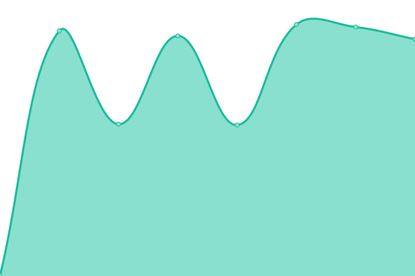
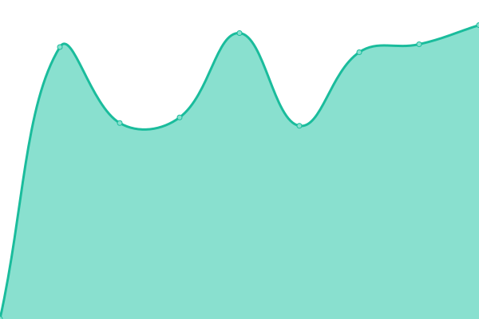

# [📈 Live Status](https://BitDEVil2K16-Club.github.io/uptime): <!--live status--> **Teilausfall**

This repository contains the open-source uptime monitor and status page for [BitDEVil2K16 Club](https://bitdevil2k16.club), powered by [Upptime](https://github.com/upptime/upptime).

With [Upptime](https://upptime.js.org), you can get your own unlimited and free uptime monitor and status page, powered entirely by a GitHub repository. We use [Issues](https://github.com/BitDEVil2K16-Club/uptime/issues) as incident reports, [Actions](https://github.com/BitDEVil2K16-Club/uptime/actions) as uptime monitors, and [Pages](https://BitDEVil2K16-Club.github.io/uptime) for the status page.

<!--start: status pages-->
<!-- This summary is generated by Upptime (https://github.com/upptime/upptime) -->
<!-- Do not edit this manually, your changes will be overwritten -->
<!-- prettier-ignore -->
| URL | Status | History | Antwortzeit | Allzeitverfügbarkeit |
| --- | ------ | ------- | ------------- | ------ |
|  [BitDEVil2K16 Club](https://bitdevil2k16.club) | 🟩 Verfügbar | [bit-de-vil2-k16-club.yml](https://github.com/BitDEVil2K16-Club/uptime/commits/HEAD/history/bit-de-vil2-k16-club.yml) | 

 679ms
     
 | 

<a href="https://stats.bitdevil2k16.club/history/bit-de-vil2-k16-club">100.00%</a>
    

|  RageServer-V (GTA-V) | 🟩 Verfügbar | [rage-server-v-gta-v.yml](https://github.com/BitDEVil2K16-Club/uptime/commits/HEAD/history/rage-server-v-gta-v.yml) | 

 426ms
     
 | 

<a href="https://stats.bitdevil2k16.club/history/rage-server-v-gta-v">99.82%</a>
    

|  Liberty GameServer | 🟩 Verfügbar | [liberty-game-server.yml](https://github.com/BitDEVil2K16-Club/uptime/commits/HEAD/history/liberty-game-server.yml) | 

 120ms
     
 | 

<a href="https://stats.bitdevil2k16.club/history/liberty-game-server">98.29%</a>
    

|  [WIKI (RSV)](https://wiki.bitdevil2k16.club) | 🟩 Verfügbar | [wiki-rsv.yml](https://github.com/BitDEVil2K16-Club/uptime/commits/HEAD/history/wiki-rsv.yml) | 

 1212ms
     
 | 

<a href="https://stats.bitdevil2k16.club/history/wiki-rsv">100.00%</a>
    

|  [Datacenter (IFPS)](https://datacenter.bitdevil2k16.club) | 🟩 Verfügbar | [datacenter-ifps.yml](https://github.com/BitDEVil2K16-Club/uptime/commits/HEAD/history/datacenter-ifps.yml) | 

 570ms
     
 | 

<a href="https://stats.bitdevil2k16.club/history/datacenter-ifps">100.00%</a>
    

|  [Freelancer Board](https://work.bitdevil2k16.club) | 🟩 Verfügbar | [freelancer-board.yml](https://github.com/BitDEVil2K16-Club/uptime/commits/HEAD/history/freelancer-board.yml) | 

 1010ms
     
 | 

<a href="https://stats.bitdevil2k16.club/history/freelancer-board">100.00%</a>
    

|  Radio Server | 🟥 Nicht Verfügbar | [radio-server.yml](https://github.com/BitDEVil2K16-Club/uptime/commits/HEAD/history/radio-server.yml) | 

 229ms
     
 | 

<a href="https://stats.bitdevil2k16.club/history/radio-server">67.18%</a>
    

<!--end: status pages-->

[**Visit our status website →**](https://BitDEVil2K16-Club.github.io/uptime)

## 📄 License

- Powered by: [Upptime](https://github.com/upptime/upptime)
- Code: [MIT](./LICENSE) © [BitDEVil2K16 Club](https://bitdevil2k16.club)
- Data in the `./history` directory: [Open Database License](https://opendatacommons.org/licenses/odbl/1-0/)
